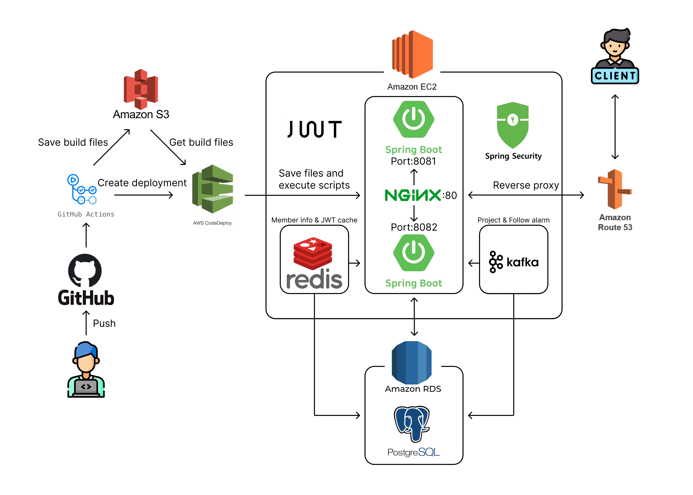
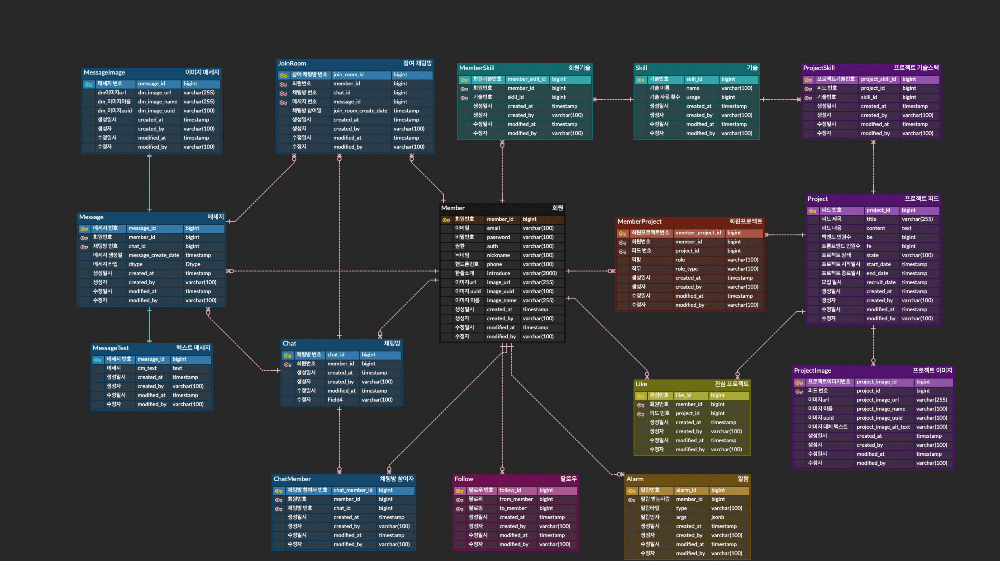

# 개발자를 위한 구인 커뮤니티 : Sodev

**기간** : 2023 06.26 ~ 08.20(1차 개발)

**규모** : 백엔드 2명, DB 테이블 17개

Swagger API 문서화:
http://sodev.world/swagger-ui/index.html

프로젝트 설계 문서:
https://docs.google.com/spreadsheets/d/1peCvXjsnPfak6XQw_hGSzoS49zpCOL1mQa8j1T4Itcw/edit#gid=1614042564

---

## 개요

프론트엔드, 백엔드 개발자들이 모여서 사이드 프로젝트 팀원을 구할 수 있게 프로젝트 팀원 구인 게시글을 작성하여 팀원을 모집합니다. 해당 프로젝트에 참여 하고자 하는 사람들이 지원하고 팀을 이루어 프로젝트를 진행할 수 있도록 하는 소셜 네트워크 팀원 구인 커뮤니티입니다. 커뮤니티라는 이름에 맞게 관심있는 프로젝트를 좋아요 버튼을 누를 수 있고, 사용자 또한 팔로우 하여 자신이 팔로우하는 회원이 구인글을 작성하면 알람을 보내는 등의 기능을 구현하여 서비스를 만들었습니다. 이로써 사이드 프로젝트 팀원을 구하기 어려운 개발자들의 고충을 해결하고 다양한 프로젝트 경험을 쌓을 수 있는 기회를 가질 수 있게 접근성을 높이는 것이 Sodev 커뮤니티의 핵심 아이디어입니다.

---
## Project Architecture

---
## ERD

---
## 사용기술

**BackEnd** : Java 17, Spring Boot 3.1.1, Spring Security, JPA, Querydsl 5.0.0, JWT

**DB** : AWS RDS - PostgreSQL 14, Redis

**Messaging & Coordination** : Kafka, Zookeeper

**Infra** : AWS EC2, S3, Nginx

**CI/CD** : GitHub Action, CodeDeploy

---

## 기술 선정 이유

### Java 17
Java 11 LTS 기간 만료가 얼마 남지 않은 상황이고, Java 17 LTS 기간이 조금 더 길어서 유지보수 관점에서 더 유리할 것이기 때문에 17 버전을 택했습니다. 
프로젝트 내부에서 새로운 기능인 `Record` 를 사용하였습니다. `Record` 는 불변객체이기 때문에 최초 생성 이후 객체의 상태 변경에 대한 걱정 없이 `DTO` 라는 명확한 의도를 가지고 데이터를 안전하게 전달할 수 있다는 장점이 있습니다.

### Spring Data JPA
객체 지향적으로 데이터를 처리할 수 있게 도와주고, 양방향 데이터 조회를 가능하게 함으로써 데이터 처리 과정을 간략화하고 `JpaRepository` 인터페이스를 통해 기본 CRUD 처리에 대한 중복 코드를 줄여 개발 생산성을 높이기 위해 선택했습니다.

### QueryDSL
문자열로 작성되는 JPQL 대신 타입 안전한 방식을 제공하여 컴파일 타임에 오류를 체크할 수 있고, 동적 쿼리 작성을 더욱 쉽고 가독성 있게 만들기 위해 선택했습니다. 

### PostgreSQL
많은 트래픽을 시나로오로 가정하고 시작한 프로젝트인 만큼 부하가 많은 상태에서 복잡한 쿼리를 대량으로 실행할 가능성이 높고, MVCC 라는 동시성 제어를 위한 기술을 지원하기 때문에 각 트랜잭션의 특정 시간대에 스냅샷을 만들어 데이터를 읽거나 쓸 때 블로킹이 감소하 성능이 향상되기 때문에 프로젝트에 적합하다고 생각했습니다.

---

## 핵심 사항
### 다대다 테이블 성능 최적화
프로젝트 구인 게시물을 등록하는 과정에 다대다 관계를 일대다 다대일 중간 테이블로 풀어내도록 설계했습니다. 게시물을 등록할 때 사용할 기술을 선택하는 과정에서 여러개의 기술을 선택하고, 코드테이블로 매핑하여 가져올 수 있도록 하였습니다. 이런 엔티티 관계에서 게시글을 등록할 당시 프로젝트에 저장되는 데이터 이외에 추가적으로 중간 테이블에 저장되는 데이터의 수가 많아져서 과도한 쿼리가 발생하였습니다. 이를 해결하기 위해 jdbcTemplate.batchUpdate 로 bulk insert, delete, update 하여 여러번 발생하던 쿼리를 한 번에 빠르게 처리할 수 있도록 개선하였습니다. 이 방법을 적용한 후 기존 방법과 비교하여 데이터 1000건 기준 약 20배 가량의 성능 개선을 이루었습니다.

### 정규화된 중간 테이블을 사용한 이유와 구조 개선
프로젝트 설계시에는 JSONB 타입을 사용하여 프로젝트 ID에 따른 기술들을 한 번에 저장하려고 계획하였습니다. 이렇게 되면 데이터 조회 및 저장에 있어 효율성이 좋을 것이라고 생각했습니다. 하지만 어느정도의 간편함과 성능 이득을 희생하더라도, 데이터 구조 변경에 대한 유연성, 데이터 무결성, 그리고 추가 정보 관리를 강화하기 위해 중간 테이블을 활용하는 정규화된 일대다, 다대일 관계를 적용하는 것이 더 적합하다고 판단되었습니다. 결과적으로 JSONB 타입의 이점을 일부 포기하였지만, 이를 통해 유지관리 측면에서 더 좋은 데이터베이스 구조를 구축하게 되어 프로젝트의 지속성 및 확장성이 향상되었습니다.

### JWT 토큰을 사용하여 인증시 서버 부담 완화
소셜 네트워킹 기반의 Sodev 개발자 구인 커뮤니티 사이트를 설계할 때, 다수의 사용자가 트래픽을 발생시킬 것이라는 시나리오를 바탕으로 프로젝트를 계획했습니다. 세션 기반 로그인을 사용하면 메모리 또는 데이터베이스에 저장되기 때문에 사용자가 많아질 경우 성능 저하가 발생할 수 있습니다. 이러한 성능 저하를 최소화하기 위해 세션 방식과 달리 별도의 인증 저장소가 필요 없는 JWT 토큰을 활용하기로 결정했습니다. 사용자가 요청할 때마다 서버에서 발급한 토큰을 검증하여 세션 방식보다 상대적으로 적은 부하 만으로도 인증을 처리할 수 있게 되었습니다.

### Redis 캐싱을 통한 DB I/O 완화
로그인 시 서버에서 사용자에게 Access 토큰과 Refresh 토큰을 발급하며 각각 30분과 2주의 만료 기간을 설정했습니다. 사용자가 API에 요청할 때마다 토큰 검증이 필요한데, 반복되는 DB I/O를 줄이기 위해 Redis in-memory를 활용해 사용자 토큰을 캐싱했습니다. Access 토큰이 만료되었지만 Refresh 토큰이 아직 만료되지 않은 경우 사용자의 로그인 상태를 유지하면서 재로그인 요청 없이 토큰을 자동으로 재발급 할 수 있도록 구현했습니다. 사용자가 로그아웃 하거나 회원 탈퇴를 할 경우 해당 회원에게 발급되었던 Access, Refresh 토큰을 블랙리스트로 저장합니다. 이로써 블랙리스트 처리된 토큰을 누군가 탈취해서 요청하더라도 적절한 에러를 반환할 수 있도록 구현하였습니다. 또한 사용자 프로필 정보, 게시글, 댓글 등의 데이터가 빈번하게 조회되는 경우에도 캐싱하여 성능을 향상시키는 방안을 고민하고 있습니다.

### Kafka 도입하여 알람 서비스 개선
알람 기능 개발시 SNS 성격의 서비스 특성상 많은 트래픽이 발생한다는 시나리오를 염두에 두어 설계하였습니다. 알람을 발송할 때 많은 사용자를 대상으로 한 트랜잭션 내에서 비즈니스 로직과 알람을 처리하게 되는 상황이 발생하면 갑작스러운 DB I/O 증가로 전체적인 시스템 성능 저하로 이어지기 때문에, 비즈니스 로직과 알람 저장 및 발송이라는 두 관심사를 분리하여 처리하였습니다. 각각의 비즈니스 로직 이후 알람이 생성이 필요한 시점에 알람 정보가 담긴 SSE 객체를 Kafka Producer, Consumer 를 사용하여 전달하고 알람 저장과 발송을 비동기로 처리할 수 있도록 개선하였습니다.

### 무중단 배포
처음 서버 배포를 완료한 이후, 운영 중 추가적인 배포가 필요한 시점에 서버가 잠시 중단되어 다시 시작하도록 설정할 때, 실 서비스 환경에서 개발 및 운영 효율이 떨어지고 사용자에게 불편을 끼칠 것으로 판단했습니다. 따라서 Nginx 리버스 프록시를 사용한 무중단 배포 환경을 구축해 문제를 해결했습니다. GitHub Actions, AWS CodeDeploy 를 연계하여 main 브랜치에 push 가 발생하면 AWS S3 저장소를 거쳐 EC2 에 저장 및 실행되도록 했습니다. Nginx 를 활용하여 현재 실행 중인 포트를 확인한 후 사용하고 있지 않은 포트로 새로운 서버를 시작하고 이전 서버를 종료합니다. 동시에, 80 포트로 들어오는 요청을 새로 배포한 서버의 포트로 전달하도록 설정했습니다

---
